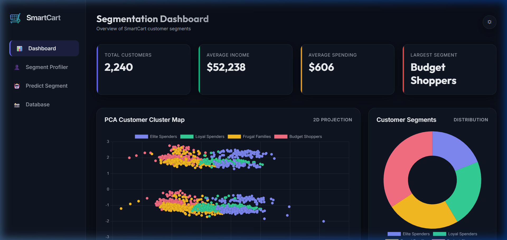
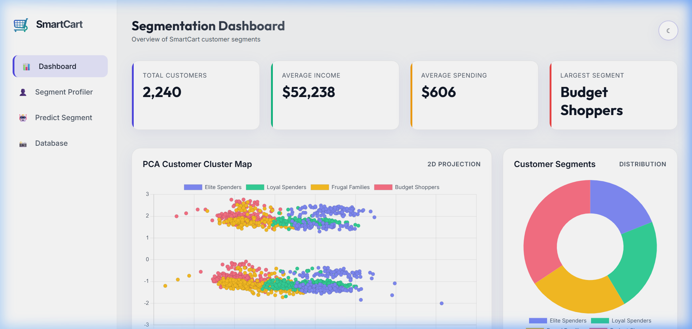
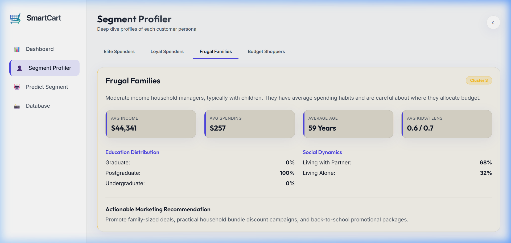
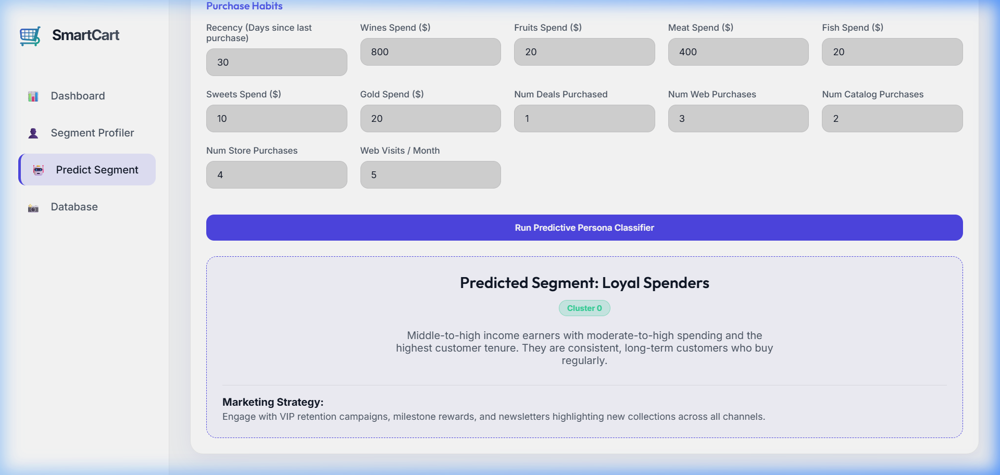
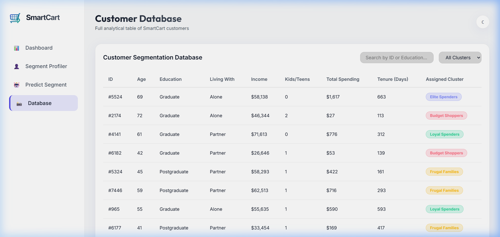
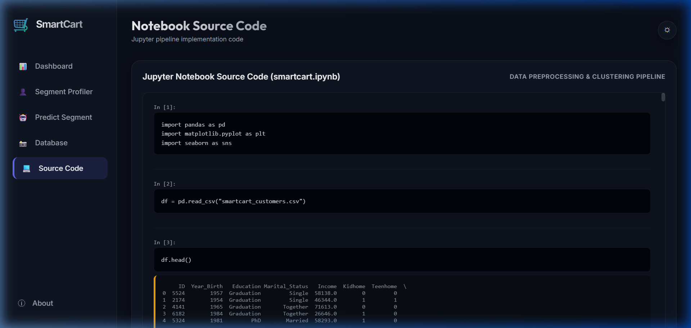
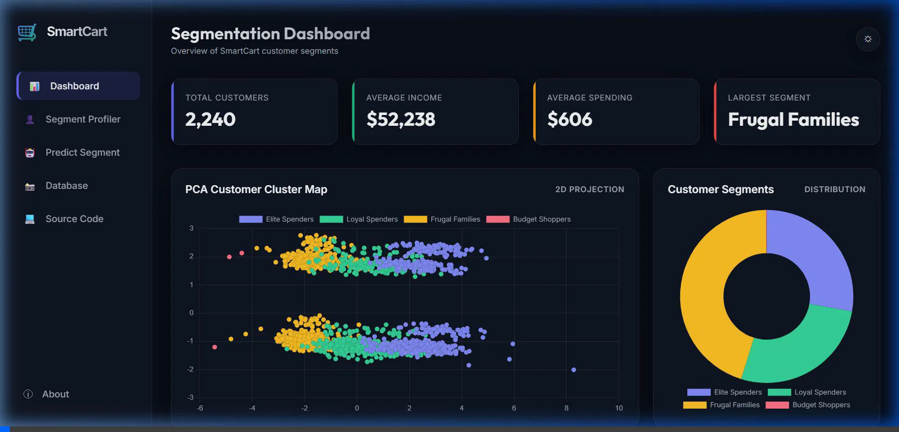

# SmartCart Customer Segmentation & Marketing Analytics Dashboard

An interactive, premium client-side customer segmentation and marketing analytics dashboard. It processes raw customer transaction data, performs feature engineering, and runs K-Means++ clustering and SVD-based Principal Component Analysis (PCA) projection directly in the browser.



## 🚀 Key Features

*   **PCA Customer Cluster Map**: An interactive 2D scatter plot projecting 18 customer features onto 2 principal components, color-coded by segment.
*   **Segment Distribution**: A donut chart showcasing the percentage and volume of customers belonging to each segment.
*   **Average Category Spending**: A grouped bar chart comparing average spending across product categories (Wines, Fruits, Meat, Fish, Sweets, Gold) for each segment.
*   **Income vs. Spending**: A scatter plot showing the correlation between annual income and total spending per cluster.
*   **Jupyter Notebook Source Code Viewer**: A dedicated tab to view and inspect the fully rendered python source code of the underlying data science pipeline (`smartcart.ipynb`).
*   **Interactive Customer Database**: A paginated, searchable, and cluster-filterable table of all 2,236 customer profiles.
*   **Predictive Persona Classifier**: A real-time calculator for marketing teams to input new customer demographics and purchase behaviors, automatically scaling, projecting, and classifying them into a segment.

---

## 👥 Customer Personas & Marketing Strategies

Based on the K-Means clustering (K=4), customers are automatically profiled and sorted by average spending into the following personas:

1.  **Elite Spenders (Cluster 0)**: High-income earners with high spending capacity, particularly on Wines and Meats.
    *   *Marketing Strategy*: VIP loyalty rewards, exclusive product pre-releases, and quality-focused (non-discount) campaigns.
2.  **Loyal Spenders (Cluster 1)**: Middle-to-high income earners with steady spending and the highest tenure.
    *   *Marketing Strategy*: Retention campaigns, milestone rewards, and omnichannel engagement.
3.  **Frugal Families (Cluster 2)**: Moderate-income households with children.
    *   *Marketing Strategy*: Family bundles, school season packages, and utility-based promotions.
4.  **Budget Shoppers (Cluster 3)**: Low-income, highly price-sensitive shoppers with larger families on average.
    *   *Marketing Strategy*: Clearance sales, discount coupons, and BOGO (Buy One Get One) deals.

---

## 🛠️ Tech Stack

*   **Structure**: Semantic HTML5 (SEO friendly)
*   **Styling**: Vanilla CSS3 (Glassmorphism layout, custom animations, CSS variables for dark/light themes)
*   **Logic**: Vanilla JavaScript (ES6+), custom client-side PCA and K-Means implementations.
*   **Libraries (via CDN)**: [Chart.js](https://www.chartjs.org/) (Visualizations), [PapaParse](https://www.papaparse.com/) (CSV Parsing)

---

## 💻 Local Setup & Development

To run the application locally, you just need a simple static file server:

1.  Clone this repository or navigate to the folder:
    ```bash
    cd "SmartCart Marketing Analytics"
    ```
2.  Start a local HTTP server:
    *   **Python**:
        ```bash
        python -m http.server 8000
        ```
    *   **Node.js (npx)**:
        ```bash
        npx serve -l 8000
        ```
3.  Open your browser and navigate to:
    `http://localhost:8000/index.html`

---

## 📸 Gallery & Interactive Walkthrough

### 🌓 Theme Customization (Dark vs Light)
The dashboard defaults to a dark mode layout and transitions into a clean light theme at the click of a button.

| Dark Theme | Light Theme |
| --- | --- |
|  |  |

### 📊 Segment Profiler & Predictions
Analyze cluster demographics and classify new users in real time.

| Segment Profiler | Predictive Persona Classifier |
| --- | --- |
|  |  |

### 🗄️ Database & Source Code
Search, filter, and inspect the raw data or view the Python Jupyter notebook (`smartcart.ipynb`) directly in the app.

| Customer Database | Jupyter Notebook Code Viewer |
| --- | --- |
|  |  |

### 🎬 Interactive Demos (WebP Animations)
*   **Dashboard Walkthrough (Theme toggling, Persona Profiling & Prediction Form)**:
    
*   **Source Code & About Tabs Navigation**:
    

